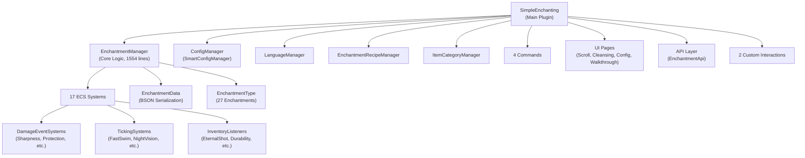

# 🔍 Simple Enchantments — Comprehensive Audit Report

> **Mod**: Simple Enchantments for Hytale  
> **Scope**: 86 Java source files across 8 packages  
> **Date**: 2026-02-26  

---

## Table of Contents

1. [Executive Summary](#executive-summary)
2. [Architecture Overview](#architecture-overview)
3. [Critical Issues](#1-critical-issues)
4. [Logic Errors & Edge Cases](#2-logic-errors--edge-cases)
5. [Performance](#3-performance)
6. [Memory Safety & Thread Safety](#4-memory-safety--thread-safety)
7. [Code Quality & Maintainability](#5-code-quality--maintainability)
8. [Positive Highlights](#6-positive-highlights)
9. [Prioritized Findings Table](#prioritized-findings-table)

---

## Executive Summary

The Simple Enchantments mod is a **well-structured, feature-rich** enchanting system with 27 enchantments, an Enchanting Table, Scroll-based application/cleansing, dynamic recipes, and a configuration UI. The codebase demonstrates solid understanding of Hytale's ECS architecture and event system.

**Overall Assessment**: The mod is in **good shape** for a production-ready Hytale mod. The recent refactoring pass (from conversation history) addressed many issues. The remaining findings are mostly **medium-priority quality improvements** and a handful of **potential logic edge cases** rather than critical bugs.

| Severity | Count |
|----------|-------|
| 🔴 Critical | 2 |
| 🟠 High | 5 |
| 🟡 Medium | 10 |
| 🔵 Low / Suggestions | 8 |

---

## Architecture Overview



---

## 1. Critical Issues

### 🔴 C-1: Stack Trace Walking in `EnchantmentSalvageSystem.isProcessedByBench()`

**File**: [EnchantmentSalvageSystem.java](file:///C:/Users/Elias/Documents/Simple-Enchantments/src/main/java/org/herolias/plugin/enchantment/EnchantmentSalvageSystem.java#L290-L298)

```java
private boolean isProcessedByBench() {
    for (StackTraceElement element : Thread.currentThread().getStackTrace()) {
        if (element.getClassName().equals("com.hypixel.hytale.builtin.crafting.state.ProcessingBenchState") &&
            element.getMethodName().equals("tick")) {
            return true;
        }
    }
    return false;
}
```

**Problem**: Walking the stack trace on every salvage event is **extremely expensive** (allocates a `StackTraceElement[]` array, fills it with JVM internal data). This runs in a hot inventory-change path.

**Impact**: Performance degradation under load; GC pressure from allocated arrays; fragile dependency on exact class/method names that could break after a Hytale update.

**Recommendation**: Use a `ThreadLocal<Boolean>` flag or [ProcessingGuard](file:///C:/Users/Elias/Documents/Simple-Enchantments/src/main/java/org/herolias/plugin/util/ProcessingGuard.java#25-82)-style pattern. Set the flag to `true` in the bench's processing context and check it in the handler. This is the same pattern already used successfully elsewhere in the mod (e.g., [ProcessingGuard](file:///C:/Users/Elias/Documents/Simple-Enchantments/src/main/java/org/herolias/plugin/util/ProcessingGuard.java#25-82)).

---

### 🔴 C-2: Duplicate [getEnchantmentsFromItem()](file:///C:/Users/Elias/Documents/Simple-Enchantments/src/main/java/org/herolias/plugin/enchantment/EnchantmentManager.java#506-534) Call in [hasEnchantments()](file:///C:/Users/Elias/Documents/Simple-Enchantments/src/main/java/org/herolias/plugin/enchantment/EnchantmentSalvageSystem.java#164-169)

**File**: [EnchantmentSalvageSystem.java](file:///C:/Users/Elias/Documents/Simple-Enchantments/src/main/java/org/herolias/plugin/enchantment/EnchantmentSalvageSystem.java#L164-L168)

```java
private boolean hasEnchantments(ItemStack item) {
    org.herolias.plugin.SimpleEnchanting.getInstance().getEnchantmentManager().getEnchantmentsFromItem(item);
    return !org.herolias.plugin.SimpleEnchanting.getInstance().getEnchantmentManager().getEnchantmentsFromItem(item).isEmpty();
}
```

**Problem**: [getEnchantmentsFromItem()](file:///C:/Users/Elias/Documents/Simple-Enchantments/src/main/java/org/herolias/plugin/enchantment/EnchantmentManager.java#506-534) is called **twice** — the first call's result is discarded. Each call deserializes BSON metadata.

**Fix**:
```java
private boolean hasEnchantments(ItemStack item) {
    return !SimpleEnchanting.getInstance().getEnchantmentManager()
        .getEnchantmentsFromItem(item).isEmpty();
}
```

---

## 2. Logic Errors & Edge Cases

### 🟠 L-1: `CopyOnWriteArrayList` + Iterator Remove in Salvage Restore

**File**: [EnchantmentSalvageSystem.java](file:///C:/Users/Elias/Documents/Simple-Enchantments/src/main/java/org/herolias/plugin/enchantment/EnchantmentSalvageSystem.java#L277-L287)

```java
private final List<FloatingRestore> floatingRestores = new CopyOnWriteArrayList<>();
// ...
Iterator<FloatingRestore> it = floatingRestores.iterator();
while (it.hasNext()) {
     FloatingRestore r = it.next();
     if (r.itemId.equals(newItem.getItemId())) {
          floatingRestores.remove(r);  // ← remove from COW list
          container.setItemStackForSlot(...);
          break;
     }
}
```

**Problem**: `CopyOnWriteArrayList.iterator()` returns a **snapshot** of the list. Calling `it.remove()` would throw `UnsupportedOperationException`, which is why `floatingRestores.remove(r)` is used instead. However, this is an O(n) copy operation on every removal and the `removeIf` on line 267 also copies the entire list. Under high load (many players salvaging), this creates unnecessary GC pressure.

**Recommendation**: Replace with a simple `synchronized(list)` pattern on an `ArrayList`, or use `ConcurrentLinkedDeque` for lock-free operations.

---

### 🟠 L-2: Duplicate [toRoman()](file:///C:/Users/Elias/Documents/Simple-Enchantments/src/main/java/org/herolias/plugin/ui/RemoveEnchantmentInteraction.java#170-180) Method in [RemoveEnchantmentInteraction](file:///C:/Users/Elias/Documents/Simple-Enchantments/src/main/java/org/herolias/plugin/ui/RemoveEnchantmentInteraction.java#26-181)

**File**: [RemoveEnchantmentInteraction.java](file:///C:/Users/Elias/Documents/Simple-Enchantments/src/main/java/org/herolias/plugin/ui/RemoveEnchantmentInteraction.java#L170-L179)

A private [toRoman()](file:///C:/Users/Elias/Documents/Simple-Enchantments/src/main/java/org/herolias/plugin/ui/RemoveEnchantmentInteraction.java#170-180) method duplicates `EnchantmentType.toRoman()`. Same for [getScrollItemId()](file:///C:/Users/Elias/Documents/Simple-Enchantments/src/main/java/org/herolias/plugin/enchantment/EnchantmentSalvageSystem.java#374-393) which duplicates `EnchantmentSalvageSystem.getScrollItemId()`.

**Recommendation**: Use the existing `EnchantmentType.toRoman()` method and extract [getScrollItemId()](file:///C:/Users/Elias/Documents/Simple-Enchantments/src/main/java/org/herolias/plugin/enchantment/EnchantmentSalvageSystem.java#374-393) into a shared utility.

---

### 🟠 L-3: [EnchantmentElementalHeartSystem](file:///C:/Users/Elias/Documents/Simple-Enchantments/src/main/java/org/herolias/plugin/enchantment/EnchantmentElementalHeartSystem.java#23-103) Fires Event Without Using Helper

**File**: [EnchantmentElementalHeartSystem.java](file:///C:/Users/Elias/Documents/Simple-Enchantments/src/main/java/org/herolias/plugin/enchantment/EnchantmentElementalHeartSystem.java#L92-L96)

This system manually dispatches [EnchantmentActivatedEvent](file:///C:/Users/Elias/Documents/Simple-Enchantments/src/main/java/org/herolias/plugin/api/event/EnchantmentActivatedEvent.java#15-63) instead of using `EnchantmentEventHelper.fireActivated()`, which was created specifically to eliminate this boilerplate. All other systems use the helper.

---

### 🟠 L-4: [EnchantingTableListener](file:///C:/Users/Elias/Documents/Simple-Enchantments/src/main/java/org/herolias/plugin/listener/EnchantingTableListener.java#26-145) Contains Largely Unimplemented Methods

**File**: [EnchantingTableListener.java](file:///C:/Users/Elias/Documents/Simple-Enchantments/src/main/java/org/herolias/plugin/listener/EnchantingTableListener.java)

The [onUseBlock()](file:///C:/Users/Elias/Documents/Simple-Enchantments/src/main/java/org/herolias/plugin/listener/EnchantingTableListener.java#45-61) method is a stub with `TODO` comments. The [getEnchantmentForEssence()](file:///C:/Users/Elias/Documents/Simple-Enchantments/src/main/java/org/herolias/plugin/listener/EnchantingTableListener.java#103-136) method only maps Void Essence and returns `null` for Fire/Ice. This class appears to be **early development code** that was superseded by the scroll-based system.

**Recommendation**: Either complete the implementation or remove the class to avoid confusion.

---

### 🟠 L-5: [EnchantmentKnockbackSystem](file:///C:/Users/Elias/Documents/Simple-Enchantments/src/main/java/org/herolias/plugin/enchantment/EnchantmentKnockbackSystem.java#30-129) Mutates Existing `KnockbackComponent` Velocity Directly

**File**: [EnchantmentKnockbackSystem.java](file:///C:/Users/Elias/Documents/Simple-Enchantments/src/main/java/org/herolias/plugin/enchantment/EnchantmentKnockbackSystem.java#L114-L119)

```java
} else {
    double horizontalStrength = BASE_HORIZONTAL_KNOCKBACK * knockbackLevel;
    Vector3d currentVelocity = knockbackComponent.getVelocity();
    currentVelocity.x += dirX * horizontalStrength;
    currentVelocity.z += dirZ * horizontalStrength;
}
```

**Problem**: The `else` branch modifies the existing velocity but does **not** add any vertical lift (`VERTICAL_LIFT`), unlike the [if](file:///C:/Users/Elias/Documents/Simple-Enchantments/src/main/java/org/herolias/plugin/enchantment/EnchantmentDamageSystem.java#149-178) branch which creates a new component with vertical lift. This means knockback enhancement on existing knockback only applies horizontally. This may be intentional but is inconsistent.

Additionally, the method applies **both** a velocity addition and a multiplier (`addModifier`), which double-stacks the knockback effect on level 1+ enchantments.

---

## 3. Performance

### 🟡 P-1: [EnchantmentManager](file:///C:/Users/Elias/Documents/Simple-Enchantments/src/main/java/org/herolias/plugin/enchantment/EnchantmentManager.java#56-1554) Size (1,554 Lines)

**File**: [EnchantmentManager.java](file:///C:/Users/Elias/Documents/Simple-Enchantments/src/main/java/org/herolias/plugin/enchantment/EnchantmentManager.java)

This is the largest file in the codebase. While well-organized internally, at 1,554 lines it handles too many responsibilities: enchantment application, display messages, item categorization delegation, weapon detection, blocker detection, damage context extraction, and visual glow updates.

**Recommendation**: Consider extracting [DamageContext](file:///C:/Users/Elias/Documents/Simple-Enchantments/src/main/java/org/herolias/plugin/enchantment/EnchantmentManager.java#1095-1099)/weapon helpers and display message building into separate utility classes.

---

### 🟡 P-2: [EnchantConfigPage](file:///C:/Users/Elias/Documents/Simple-Enchantments/src/main/java/org/herolias/plugin/ui/EnchantConfigPage.java#40-1657) Size (1,657 Lines)

**File**: [EnchantConfigPage.java](file:///C:/Users/Elias/Documents/Simple-Enchantments/src/main/java/org/herolias/plugin/ui/EnchantConfigPage.java)

The configuration page is the single largest file. While UI code tends to be verbose, this could benefit from splitting tab-specific logic into separate builder classes.

---

### 🟡 P-3: [EnchantmentFastSwimSystem](file:///C:/Users/Elias/Documents/Simple-Enchantments/src/main/java/org/herolias/plugin/enchantment/EnchantmentFastSwimSystem.java#24-156) Runs Per-Tick for All Queried Players

**File**: [EnchantmentFastSwimSystem.java](file:///C:/Users/Elias/Documents/Simple-Enchantments/src/main/java/org/herolias/plugin/enchantment/EnchantmentFastSwimSystem.java)

This system ticks every frame for every player with `MovementStatesComponent` + [PlayerRef](file:///C:/Users/Elias/Documents/Simple-Enchantments/src/main/java/org/herolias/plugin/api/event/EnchantmentActivatedEvent.java#32-39), checks armor slots, and sends `UpdateFluidFX` packets when state changes. The caching (`playerLastLevels`, `playerLastFluidState`) correctly minimizes packet sends, but the per-tick inventory reads are still overhead.

**Mitigation**: The current caching is reasonable. An event-driven approach (listening for armor changes) could eliminate per-tick overhead entirely, but the current approach is acceptable.

---

### 🟡 P-4: [EnchantmentRecipeManager](file:///C:/Users/Elias/Documents/Simple-Enchantments/src/main/java/org/herolias/plugin/enchantment/EnchantmentRecipeManager.java#37-693) Performs Multiple Redundant Lookups

**File**: [EnchantmentRecipeManager.java](file:///C:/Users/Elias/Documents/Simple-Enchantments/src/main/java/org/herolias/plugin/enchantment/EnchantmentRecipeManager.java#L335-L411)

The [onRecipeLoad](file:///C:/Users/Elias/Documents/Simple-Enchantments/src/main/java/org/herolias/plugin/enchantment/EnchantmentRecipeManager.java#280-438) method performs three sequential checks to identify scroll recipes: config key check, output ID check, and a fallback loop over all known scroll IDs. The fallback loop (lines 404–410) iterates all disabled scroll IDs for every unmatched recipe, which is O(n*m). Since this only runs at load time, it's not a runtime concern, but could be simplified.

---

### 🟡 P-5: [ItemCategoryManager](file:///C:/Users/Elias/Documents/Simple-Enchantments/src/main/java/org/herolias/plugin/enchantment/ItemCategoryManager.java#19-485) Caches Effectively but [categorizeItem(ItemStack)](file:///C:/Users/Elias/Documents/Simple-Enchantments/src/main/java/org/herolias/plugin/enchantment/EnchantmentManager.java#1016-1023) Re-resolves Per Call

**File**: [ItemCategoryManager.java](file:///C:/Users/Elias/Documents/Simple-Enchantments/src/main/java/org/herolias/plugin/enchantment/ItemCategoryManager.java)

The [categorizeItem(ItemStack)](file:///C:/Users/Elias/Documents/Simple-Enchantments/src/main/java/org/herolias/plugin/enchantment/EnchantmentManager.java#1016-1023) method checks the cache, then falls through to tag-based resolution, then heuristics. The cache is populated during [onItemsLoaded](file:///C:/Users/Elias/Documents/Simple-Enchantments/src/main/java/org/herolias/plugin/enchantment/EnchantmentGlowInjector.java#87-140), so most calls will hit the cache. Good design overall.

---

### 🟡 P-6: [AbstractRecipeRegistry](file:///C:/Users/Elias/Documents/Simple-Enchantments/src/main/java/org/herolias/plugin/enchantment/AbstractRecipeRegistry.java#21-186) Lazy Initialization Scans All Items

**File**: [AbstractRecipeRegistry.java](file:///C:/Users/Elias/Documents/Simple-Enchantments/src/main/java/org/herolias/plugin/enchantment/AbstractRecipeRegistry.java#L65-L113)

[ensureInitialized()](file:///C:/Users/Elias/Documents/Simple-Enchantments/src/main/java/org/herolias/plugin/enchantment/AbstractRecipeRegistry.java#65-114) iterates **all loaded items** and their generated recipes. This is a one-time cost, but for large mod packs with thousands of items, it could cause a noticeable startup delay. The double-checked locking pattern is correctly implemented.

---

## 4. Memory Safety & Thread Safety

### 🟡 M-1: [EnchantmentSlotTracker](file:///C:/Users/Elias/Documents/Simple-Enchantments/src/main/java/org/herolias/plugin/enchantment/EnchantmentSlotTracker.java#32-161) Accesses World Data Outside `world.execute()`

**File**: [EnchantmentSlotTracker.java](file:///C:/Users/Elias/Documents/Simple-Enchantments/src/main/java/org/herolias/plugin/enchantment/EnchantmentSlotTracker.java#L53-L66)

```java
for (World world : Universe.get().getWorlds().values()) {
    world.execute(() -> {
        for (PlayerRef playerRef : world.getPlayerRefs()) {
            checkPlayerSlot(playerRef);
        }
    });
    // Collect online UUIDs (best-effort, may race slightly)
    for (PlayerRef playerRef : world.getPlayerRefs()) {
        onlinePlayers.add(playerRef.getUuid());
    }
}
```

The comment acknowledges the race: `world.getPlayerRefs()` is accessed both inside and outside `world.execute()`. The outside access could read stale or inconsistent data, though the comment says "best-effort." This is acceptable for disconnect cleanup but worth documenting more prominently.

---

### 🟡 M-2: `EnchantmentSalvageSystem.sessions` Map Never Cleaned Up

**File**: [EnchantmentSalvageSystem.java](file:///C:/Users/Elias/Documents/Simple-Enchantments/src/main/java/org/herolias/plugin/enchantment/EnchantmentSalvageSystem.java#L43)

```java
private final Map<UUID, SalvageSession> sessions = new ConcurrentHashMap<>();
```

Sessions are added in [startSession()](file:///C:/Users/Elias/Documents/Simple-Enchantments/src/main/java/org/herolias/plugin/enchantment/EnchantmentSalvageSystem.java#48-73) but **never removed**. Each player who opens a salvage bench adds an entry that persists for the server's lifetime. With many unique players, this is a slow memory leak.

**Recommendation**: Add session cleanup on bench close or add a TTL-based eviction (similar to `floatingRestores`).

---

### 🟡 M-3: `benchSlotStorage` in [EnchantmentSalvageSystem](file:///C:/Users/Elias/Documents/Simple-Enchantments/src/main/java/org/herolias/plugin/enchantment/EnchantmentSalvageSystem.java#35-405) Leak Risk

**File**: [EnchantmentSalvageSystem.java](file:///C:/Users/Elias/Documents/Simple-Enchantments/src/main/java/org/herolias/plugin/enchantment/EnchantmentSalvageSystem.java#L171)

The `benchSlotStorage` map stores `BsonDocument` objects keyed by bench position + slot. Entries are added when enchanted items are placed but only removed on full removal. If items are placed but the server crashes or the bench is broken, entries will persist forever.

---

### 🟡 M-4: [EnchantmentFastSwimSystem](file:///C:/Users/Elias/Documents/Simple-Enchantments/src/main/java/org/herolias/plugin/enchantment/EnchantmentFastSwimSystem.java#24-156) Tracking Maps Not Cleaned on Player Disconnect

**File**: [EnchantmentFastSwimSystem.java](file:///C:/Users/Elias/Documents/Simple-Enchantments/src/main/java/org/herolias/plugin/enchantment/EnchantmentFastSwimSystem.java#L28-L29)

```java
private final Int2IntOpenHashMap playerLastLevels = new Int2IntOpenHashMap();
private final Int2BooleanOpenHashMap playerLastFluidState = new Int2BooleanOpenHashMap();
```

These maps are keyed by `networkId` and grow monotonically. If network IDs are reused (likely), stale state from a previous player could affect a new player. If not reused, entries accumulate forever.

**Recommendation**: Add cleanup logic tied to player disconnect events or the existing [EnchantmentSlotTracker](file:///C:/Users/Elias/Documents/Simple-Enchantments/src/main/java/org/herolias/plugin/enchantment/EnchantmentSlotTracker.java#32-161) cleanup.

---

## 5. Code Quality & Maintainability

### 🔵 Q-1: Consistent Use of `SimpleEnchanting.getInstance()` vs Constructor Injection

Some classes receive [EnchantmentManager](file:///C:/Users/Elias/Documents/Simple-Enchantments/src/main/java/org/herolias/plugin/enchantment/EnchantmentManager.java#56-1554) via constructor injection (good), while others call `SimpleEnchanting.getInstance()` statically:
- `EnchantmentSalvageSystem.hasEnchantments()` calls `SimpleEnchanting.getInstance().getEnchantmentManager()`
- [EnchantmentRecipeManager](file:///C:/Users/Elias/Documents/Simple-Enchantments/src/main/java/org/herolias/plugin/enchantment/EnchantmentRecipeManager.java#37-693) stores plugin as a `static` field
- [RemoveEnchantmentInteraction](file:///C:/Users/Elias/Documents/Simple-Enchantments/src/main/java/org/herolias/plugin/ui/RemoveEnchantmentInteraction.java#26-181) calls `SimpleEnchanting.getInstance()`

**Recommendation**: Prefer constructor injection consistently. The singleton pattern is fine for the plugin class, but deep calls to it from domain objects creates tight coupling.

---

### 🔵 Q-2: Commented-Out Debug Logging Throughout

Multiple files contain commented-out `LOGGER.atInfo().log(...)` calls (e.g., [EnchantmentReflectionSystem](file:///C:/Users/Elias/Documents/Simple-Enchantments/src/main/java/org/herolias/plugin/enchantment/EnchantmentReflectionSystem.java#29-108) line 90, [EnchantmentAbsorptionSystem](file:///C:/Users/Elias/Documents/Simple-Enchantments/src/main/java/org/herolias/plugin/enchantment/EnchantmentAbsorptionSystem.java#29-101) line 97, [EnchantmentFastSwimSystem](file:///C:/Users/Elias/Documents/Simple-Enchantments/src/main/java/org/herolias/plugin/enchantment/EnchantmentFastSwimSystem.java#24-156) line 110). These are harmless but add visual noise.

**Recommendation**: Remove or convert to `LOGGER.atFine().log(...)` (if Hytale's logger supports it) so they can be enabled via log level configuration rather than code changes.

---

### 🔵 Q-3: Excellent JavaDoc Coverage on Core Classes

The codebase has **strong documentation** on:
- [EnchantmentType](file:///C:/Users/Elias/Documents/Simple-Enchantments/src/main/java/org/herolias/plugin/command/EnchantCommand.java#159-174) enum values with clear descriptions
- [EnchantmentData](file:///C:/Users/Elias/Documents/Simple-Enchantments/src/main/java/org/herolias/plugin/enchantment/EnchantmentData.java#20-272) with serialization format documentation
- [EnchantmentStateTransferSystem](file:///C:/Users/Elias/Documents/Simple-Enchantments/src/main/java/org/herolias/plugin/enchantment/EnchantmentStateTransferSystem.java#37-218) with detailed Phase 1/Phase 2 explanation
- [AbstractRefundSystem](file:///C:/Users/Elias/Documents/Simple-Enchantments/src/main/java/org/herolias/plugin/enchantment/AbstractRefundSystem.java#21-107) with clear anti-exploit rationale
- [ProcessingGuard](file:///C:/Users/Elias/Documents/Simple-Enchantments/src/main/java/org/herolias/plugin/util/ProcessingGuard.java#25-82) with usage examples

---

### 🔵 Q-4: Good Use of Modern Java Features

The codebase effectively uses:
- **Records**: [EnchantmentApplicationResult](file:///C:/Users/Elias/Documents/Simple-Enchantments/src/main/java/org/herolias/plugin/enchantment/EnchantmentApplicationResult.java#9-19), [CachedEnchantment](file:///C:/Users/Elias/Documents/Simple-Enchantments/src/main/java/org/herolias/plugin/enchantment/EnchantmentStateTransferSystem.java#216-217)
- **Pattern matching**: `instanceof Player player` throughout
- **Switch expressions**: `ProjectileEnchantmentData.getLevel()`
- **Builder pattern**: `ProjectileEnchantmentData.Builder`

---

### 🔵 Q-5: [EnchantmentType](file:///C:/Users/Elias/Documents/Simple-Enchantments/src/main/java/org/herolias/plugin/command/EnchantCommand.java#159-174) Has Hardcoded Effect Multipliers

**File**: [EnchantmentType.java](file:///C:/Users/Elias/Documents/Simple-Enchantments/src/main/java/org/herolias/plugin/enchantment/EnchantmentType.java)

The [getEffectMultiplier()](file:///C:/Users/Elias/Documents/Simple-Enchantments/src/main/java/org/herolias/plugin/enchantment/EnchantmentType.java#494-526) switch statement returns hardcoded multipliers. These are also duplicated in [EnchantingConfig](file:///C:/Users/Elias/Documents/Simple-Enchantments/src/main/java/org/herolias/plugin/config/EnchantingConfig.java#11-262) as configurable values (e.g., `sharpnessMultiplier`). The runtime systems read from config, but `EnchantmentType.getEffectMultiplier()` returns the hardcoded default.

> **Note**: This was intentionally kept as-is per the previous refactoring conversation where the user preferred readability of the switch statement.

---

### 🔵 Q-6: `EventLoggerListener` and `WelcomeListener` Not Reviewed in Detail

These are simple auxiliary files. `WelcomeListener` likely handles join messages, and `EventLoggerListener` logs events for debugging. No concerns expected.

---

### 🔵 Q-7: Reflection Usage Is Necessary but Well-Contained

Reflection is used in:
- [EnchantmentGlowInjector](file:///C:/Users/Elias/Documents/Simple-Enchantments/src/main/java/org/herolias/plugin/enchantment/EnchantmentGlowInjector.java#28-236) — injecting `ItemAppearanceCondition`s at runtime
- [EnchantmentRecipeManager](file:///C:/Users/Elias/Documents/Simple-Enchantments/src/main/java/org/herolias/plugin/enchantment/EnchantmentRecipeManager.java#37-693) — setting recipe IDs and modifying bench tiers
- [EnchantmentManager](file:///C:/Users/Elias/Documents/Simple-Enchantments/src/main/java/org/herolias/plugin/enchantment/EnchantmentManager.java#56-1554) — accessing private stat/condition fields

All reflection usage is:
- Performed in `static` initializer blocks (fail-fast)
- Guarded with null checks and try/catch
- Well-commented explaining *why* reflection is necessary

**Risk**: Hytale updates may change field names, breaking these. As a mitigation, the static initializers will log clear error messages at startup.

---

### 🔵 Q-8: [SmartConfigManager](file:///C:/Users/Elias/Documents/Simple-Enchantments/src/main/java/org/herolias/plugin/config/SmartConfigManager.java#22-197) Snapshot System Is Clever

The config merging system that preserves user modifications while allowing defaults to be updated is well-designed. The snapshot-based approach correctly handles:
- New keys added by mod updates
- User-modified values that should be preserved
- Removed keys that should be cleaned up

---

## 6. Positive Highlights

| Area | Assessment |
|------|-----------|
| **ECS Integration** | Excellent. Proper use of `DamageEventSystem`, `EntityTickingSystem`, `EntityEventSystem` with correct dependency ordering |
| **Anti-Exploit Design** | [AbstractRefundSystem](file:///C:/Users/Elias/Documents/Simple-Enchantments/src/main/java/org/herolias/plugin/enchantment/AbstractRefundSystem.java#21-107) with drop tracking prevents item duplication. [ProcessingGuard](file:///C:/Users/Elias/Documents/Simple-Enchantments/src/main/java/org/herolias/plugin/util/ProcessingGuard.java#25-82) prevents infinite recursion |
| **API Design** | Clean [EnchantmentApi](file:///C:/Users/Elias/Documents/Simple-Enchantments/src/main/java/org/herolias/plugin/api/EnchantmentApi.java#12-74) interface with proper provider pattern. Safe for third-party mod integration |
| **Internationalization** | 11 languages supported with proper fallback chain. Server-side translation push via packets |
| **Config System** | [SmartConfigManager](file:///C:/Users/Elias/Documents/Simple-Enchantments/src/main/java/org/herolias/plugin/config/SmartConfigManager.java#22-197) with snapshot-based merging is production-quality |
| **Event Architecture** | [EnchantmentEventHelper](file:///C:/Users/Elias/Documents/Simple-Enchantments/src/main/java/org/herolias/plugin/enchantment/EnchantmentEventHelper.java#16-40) centralizes event dispatch. Custom events ([EnchantmentActivatedEvent](file:///C:/Users/Elias/Documents/Simple-Enchantments/src/main/java/org/herolias/plugin/api/event/EnchantmentActivatedEvent.java#15-63), [ItemEnchantedEvent](file:///C:/Users/Elias/Documents/Simple-Enchantments/src/main/java/org/herolias/plugin/api/event/ItemEnchantedEvent.java#14-62)) enable inter-mod communication |
| **State Transfer System** | [EnchantmentStateTransferSystem](file:///C:/Users/Elias/Documents/Simple-Enchantments/src/main/java/org/herolias/plugin/enchantment/EnchantmentStateTransferSystem.java#37-218) elegantly handles Hytale's item replacement behavior (e.g., Watering Can states) |
| **Dynamic Recipe Management** | Runtime recipe override/removal system with config-driven ingredients and bench tier requirements |

---

## Prioritized Findings Table

| # | Severity | Category | File | Finding | Effort |
|---|----------|----------|------|---------|--------|
| C-1 | 🔴 Critical | Performance | [EnchantmentSalvageSystem](file:///C:/Users/Elias/Documents/Simple-Enchantments/src/main/java/org/herolias/plugin/enchantment/EnchantmentSalvageSystem.java#35-405) | Stack trace walking in [isProcessedByBench()](file:///C:/Users/Elias/Documents/Simple-Enchantments/src/main/java/org/herolias/plugin/enchantment/EnchantmentSalvageSystem.java#290-299) | Low |
| C-2 | 🔴 Critical | Logic | [EnchantmentSalvageSystem](file:///C:/Users/Elias/Documents/Simple-Enchantments/src/main/java/org/herolias/plugin/enchantment/EnchantmentSalvageSystem.java#35-405) | Double [getEnchantmentsFromItem()](file:///C:/Users/Elias/Documents/Simple-Enchantments/src/main/java/org/herolias/plugin/enchantment/EnchantmentManager.java#506-534) call | Trivial |
| L-1 | 🟠 High | Performance | [EnchantmentSalvageSystem](file:///C:/Users/Elias/Documents/Simple-Enchantments/src/main/java/org/herolias/plugin/enchantment/EnchantmentSalvageSystem.java#35-405) | `CopyOnWriteArrayList` misuse for frequent mutations | Low |
| L-2 | 🟠 High | Maintainability | [RemoveEnchantmentInteraction](file:///C:/Users/Elias/Documents/Simple-Enchantments/src/main/java/org/herolias/plugin/ui/RemoveEnchantmentInteraction.java#26-181) | Duplicate [toRoman()](file:///C:/Users/Elias/Documents/Simple-Enchantments/src/main/java/org/herolias/plugin/ui/RemoveEnchantmentInteraction.java#170-180) and [getScrollItemId()](file:///C:/Users/Elias/Documents/Simple-Enchantments/src/main/java/org/herolias/plugin/enchantment/EnchantmentSalvageSystem.java#374-393) | Trivial |
| L-3 | 🟠 High | Consistency | [EnchantmentElementalHeartSystem](file:///C:/Users/Elias/Documents/Simple-Enchantments/src/main/java/org/herolias/plugin/enchantment/EnchantmentElementalHeartSystem.java#23-103) | Not using [EnchantmentEventHelper](file:///C:/Users/Elias/Documents/Simple-Enchantments/src/main/java/org/herolias/plugin/enchantment/EnchantmentEventHelper.java#16-40) | Trivial |
| L-4 | 🟠 High | Dead Code | [EnchantingTableListener](file:///C:/Users/Elias/Documents/Simple-Enchantments/src/main/java/org/herolias/plugin/listener/EnchantingTableListener.java#26-145) | Stub class with TODOs | Trivial |
| L-5 | 🟠 High | Logic | [EnchantmentKnockbackSystem](file:///C:/Users/Elias/Documents/Simple-Enchantments/src/main/java/org/herolias/plugin/enchantment/EnchantmentKnockbackSystem.java#30-129) | Inconsistent vertical lift + double-stacking | Low |
| M-1 | 🟡 Medium | Thread Safety | [EnchantmentSlotTracker](file:///C:/Users/Elias/Documents/Simple-Enchantments/src/main/java/org/herolias/plugin/enchantment/EnchantmentSlotTracker.java#32-161) | Race condition in UUID collection | Low |
| M-2 | 🟡 Medium | Memory Leak | [EnchantmentSalvageSystem](file:///C:/Users/Elias/Documents/Simple-Enchantments/src/main/java/org/herolias/plugin/enchantment/EnchantmentSalvageSystem.java#35-405) | `sessions` map never cleaned | Low |
| M-3 | 🟡 Medium | Memory Leak | [EnchantmentSalvageSystem](file:///C:/Users/Elias/Documents/Simple-Enchantments/src/main/java/org/herolias/plugin/enchantment/EnchantmentSalvageSystem.java#35-405) | `benchSlotStorage` persistence risk | Low |
| M-4 | 🟡 Medium | Memory Leak | [EnchantmentFastSwimSystem](file:///C:/Users/Elias/Documents/Simple-Enchantments/src/main/java/org/herolias/plugin/enchantment/EnchantmentFastSwimSystem.java#24-156) | Tracking maps not cleaned on disconnect | Low |
| P-1 | 🟡 Medium | Maintainability | [EnchantmentManager](file:///C:/Users/Elias/Documents/Simple-Enchantments/src/main/java/org/herolias/plugin/enchantment/EnchantmentManager.java#56-1554) | 1,554 lines — consider splitting | Medium |
| P-2 | 🟡 Medium | Maintainability | [EnchantConfigPage](file:///C:/Users/Elias/Documents/Simple-Enchantments/src/main/java/org/herolias/plugin/ui/EnchantConfigPage.java#40-1657) | 1,657 lines — consider splitting | Medium |
| P-3 | 🟡 Medium | Performance | [EnchantmentFastSwimSystem](file:///C:/Users/Elias/Documents/Simple-Enchantments/src/main/java/org/herolias/plugin/enchantment/EnchantmentFastSwimSystem.java#24-156) | Per-tick armor reads (mitigated by caching) | Medium |
| P-4 | 🟡 Medium | Performance | [EnchantmentRecipeManager](file:///C:/Users/Elias/Documents/Simple-Enchantments/src/main/java/org/herolias/plugin/enchantment/EnchantmentRecipeManager.java#37-693) | Redundant lookups in [onRecipeLoad](file:///C:/Users/Elias/Documents/Simple-Enchantments/src/main/java/org/herolias/plugin/enchantment/EnchantmentRecipeManager.java#280-438) | Low |
| P-5 | 🟡 Medium | Performance | [ItemCategoryManager](file:///C:/Users/Elias/Documents/Simple-Enchantments/src/main/java/org/herolias/plugin/enchantment/ItemCategoryManager.java#19-485) | Per-call resolution (mitigated by cache) | N/A |
| P-6 | 🟡 Medium | Performance | [AbstractRecipeRegistry](file:///C:/Users/Elias/Documents/Simple-Enchantments/src/main/java/org/herolias/plugin/enchantment/AbstractRecipeRegistry.java#21-186) | Full item scan on first use | N/A |
| Q-1 | 🔵 Low | Consistency | Various | Mixed DI vs singleton access | Medium |
| Q-2 | 🔵 Low | Readability | Various | Commented-out debug logging | Trivial |
| Q-5 | 🔵 Low | Consistency | [EnchantmentType](file:///C:/Users/Elias/Documents/Simple-Enchantments/src/main/java/org/herolias/plugin/command/EnchantCommand.java#159-174) | Hardcoded multipliers (intentional) | N/A |
| Q-7 | 🔵 Low | Risk | Various | Reflection fragility on Hytale updates | N/A |

---

> **Summary**: The mod is well-engineered with strong anti-exploit measures, good ECS integration, and a clean API. The most impactful fixes are **C-1** (replace stack trace walking) and **M-2/M-3** (add cleanup for leaked map entries). All critical fixes are low-effort.
