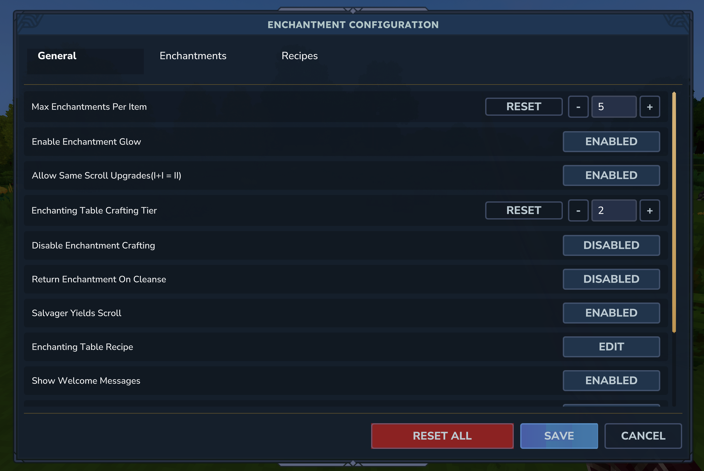
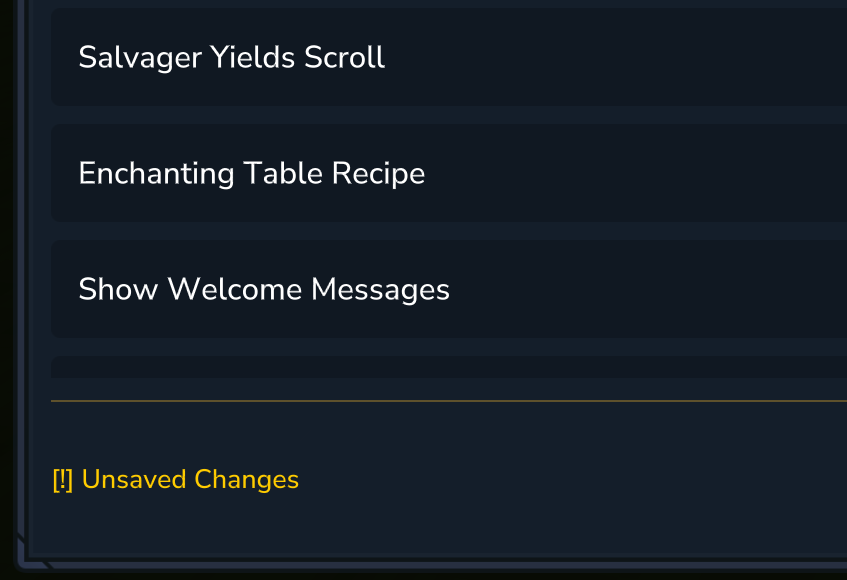
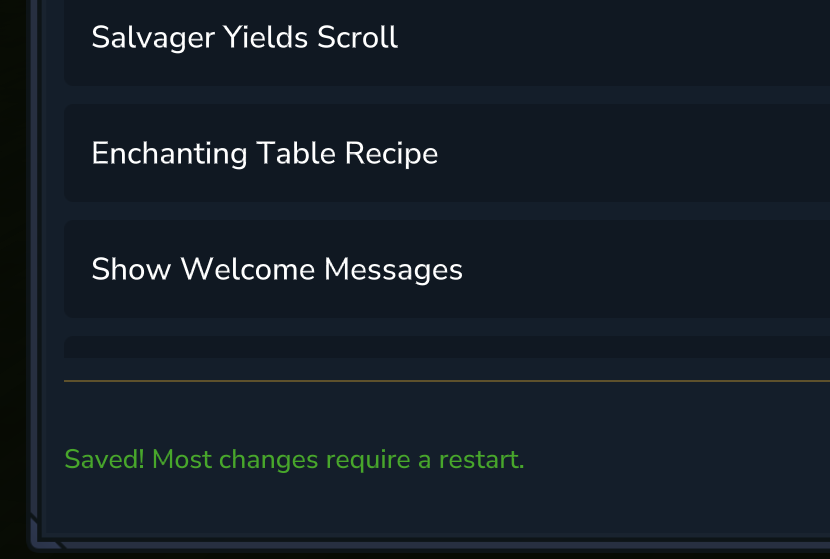

# The in-game Config

Simple Enchantments has an in-game config editor for easier customization. In theory, you'd never have to touch the the json files in the mods folder. 
You can access the config via the /enchantconfig command. This command requires OP-Permissions. You are greeted with a menu with 3 Tabs: 
General, Enchantments and Recipies

More on the 3 Tabs on the next Pages.

After making changes in the config editor, make sure to click on save, otherwhise your progress will be lost. There is also an Indicator for unsaved changes and a confirmation for when you successfully saved your changes. 
 

Most changes require a Server-restart to become effective.
If you want to revert changes, most options have a reset button next to them that resets it to its default value. If you want to start from scratch, there is also an reset all button. 

All changes you make in the in-game config editor get saved to the simple-enchantments-config.json file (more on that later), so you can easily migrate your config from a test server to your main server.
