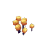

# Night Vision

Enhances visibility in dark environments such as caves, nighttime, and underwater.

## Stats and Recipe

<h3>Stats</h3>
<table>
<thead>
<tr><th>Field</th><th>Value</th></tr>
</thead>
<tbody>
<tr><td>Added in Version</td><td><!-- MANUAL:added-version:start --> <!-- MANUAL:added-version:end --></td></tr>
<tr><td>Default Modifier</td><td>None</td></tr>
<tr><td>Amount of Levels</td><td>1 (I)</td></tr>
<tr><td>ID</td><td><code>night_vision</code></td></tr>
<tr><td>Can Be Applied To</td><td>Helmets</td></tr>
<tr><td>Enabled By Default</td><td>No</td></tr>
<tr><td>Crafting Tier</td><td><code>4</code></td></tr>
</tbody>
</table>

<h3>Recipe</h3>
<table>
<thead>
<tr><th>Ingredient</th><th>Amount</th></tr>
</thead>
<tbody>
<tr><td> Cindercloth Scraps</td><td><code>5</code></td></tr>
<tr><td> Essence of Fire</td><td><code>30</code></td></tr>
<tr><td> Yellow Crystal Shards</td><td><code>30</code></td></tr>
<tr><td> Orange Glowing Mushroom</td><td><code>20</code></td></tr>
</tbody>
</table>

## Showcase

<!-- MANUAL:showcase:start -->
<!-- Add a GIF or screenshot here. -->
<!-- MANUAL:showcase:end -->
