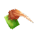
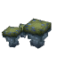

# Poison

Poisons targets on hit (3 damage/s for 4s). Not combinable with Burn.

## Stats

| Field | Value |
|---|---|
| Added in Version | <!-- MANUAL:added-version:start --> <!-- MANUAL:added-version:end --> |
| Default Modifier | Damage Per Second: `3 damage/s`; Duration (Seconds): `4s` |
| Amount of Levels | 1 (I) |
| ID | `poison` |
| Can Be Applied To | Melee Weapons, Ranged Weapons |
| Enabled By Default | Yes |
| Recipe | Unlock tier `4`; ingredients are listed below. |
| Conflicts With | [Burn](burn.md) |

## Recipe

Unlock tier: `4`.

| Ingredient | Amount |
|---|---:|
|  Cindercloth Scraps | `5` |
|  Venom Sac | `25` |
|  Green Crystal Shards | `30` |
|  Spotted Green Cap Mushroom | `20` |

## Showcase

<!-- MANUAL:showcase:start -->
<!-- Add a GIF or screenshot here. -->
<!-- MANUAL:showcase:end -->
