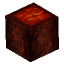

# Smelting

Automatically smelts mined blocks.

## Stats

| Field | Value |
|---|---|
| Added in Version | <!-- MANUAL:added-version:start --> <!-- MANUAL:added-version:end --> |
| Default Modifier | None |
| Amount of Levels | 1 (I) |
| ID | `smelting` |
| Can Be Applied To | Pickaxes |
| Enabled By Default | Yes |
| Recipe | Unlock tier `4`; ingredients are listed below. |
| Conflicts With | [Pick Perfect](pick-perfect.md) |

## Recipe

Unlock tier: `4`.

| Ingredient | Amount |
|---|---:|
|  Cindercloth Scraps | `5` |
|  Essence of Fire | `30` |
|  Fire Log | `30` |

## Showcase

<!-- MANUAL:showcase:start -->
<!-- Add a GIF or screenshot here. -->
<!-- MANUAL:showcase:end -->
