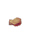

# Waterbreathing

Reduces oxygen drain by 20%.

## Stats

| Field | Value |
|---|---|
| Added in Version | <!-- MANUAL:added-version:start --> <!-- MANUAL:added-version:end --> |
| Default Modifier | Drain Reduction Per Level: `20%` |
| Amount of Levels | 3 (I-III) |
| ID | `waterbreathing` |
| Can Be Applied To | Helmets |
| Enabled By Default | Yes |
| Recipe | Unlock tier `1/2/3`; ingredients are listed below. |

## Recipe

Unlock tier: `1/2/3`.

Amounts are listed as `I/II/III`.

| Ingredient | Amount |
|---|---:|
|  Cindercloth Scraps | `5/5/5` |
|  Essence of Water | `1/2/3` |
|  Coral Seashell | `5/7/10` |
|  Blue Crystal Shards | `15/20/30` |

## Showcase

<!-- MANUAL:showcase:start -->
<!-- Add a GIF or screenshot here. -->
<!-- MANUAL:showcase:end -->
