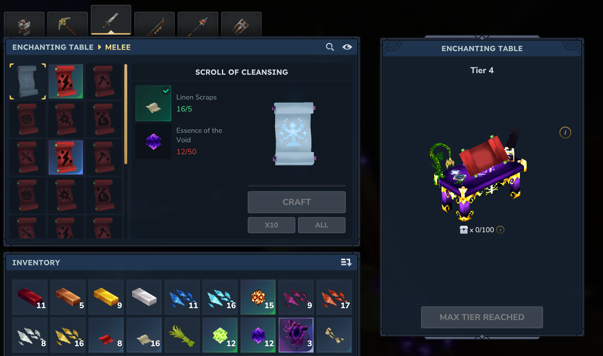
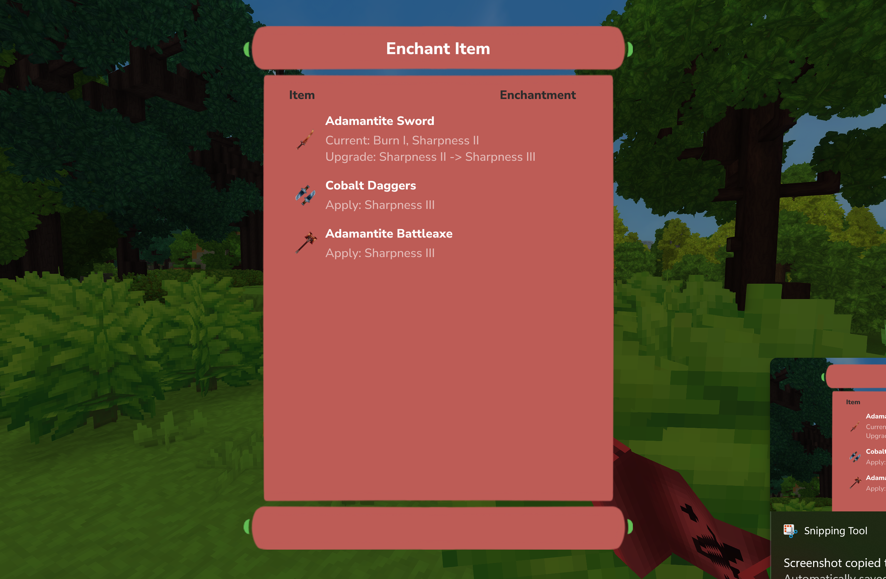

# Scrolls

Scrolls are used to apply Enchantments to your Items. They come in different rarities, showing how strong the enchantment is. After crafting a Scroll at the Enchanting Table, you can apply it to a fitting Item by right or left-clicking with the scroll in your hand.

After successfully applying an Enchantment from a Scroll to an Item, the Scroll gets destroyed.

You can also [Combine](combining-scrolls.md) Scrolls for better Storage management.
