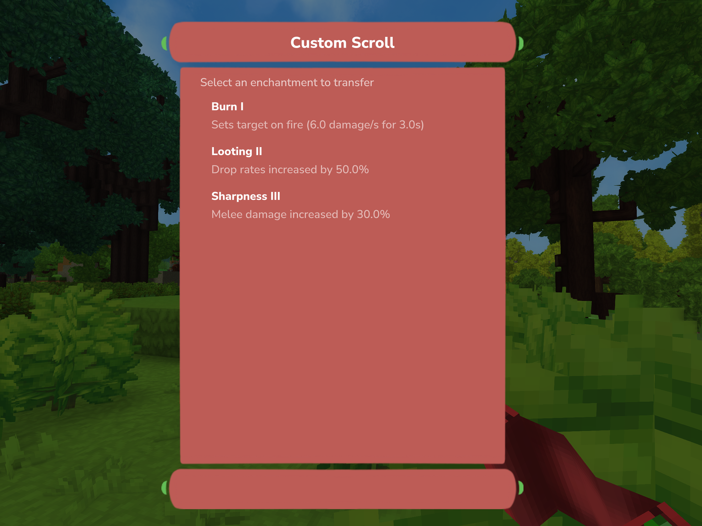

# Combining Scrolls

You can combine multiple Scrolls (up to <!-- DOCSTAT:config.maxEnchantmentsPerItem -->5<!-- /DOCSTAT --> by default) into one Custom Scroll that holds all the Enchantments of the Scrolls you combined.

You can then apply the Enchantments from the Custom Scroll one-by-one to different Items. After the last Enchantment is applyied, the Scroll gets destroyed.
