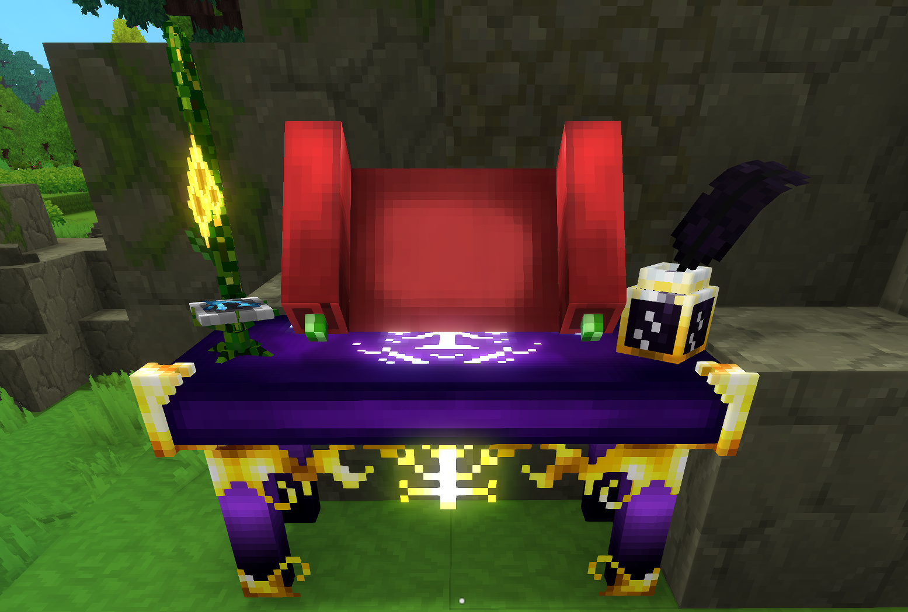
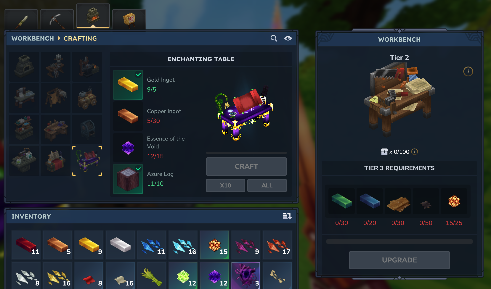

# The Enchanting Table

To get started with Simple Enchantments, you need to craft an Enchanting Table at the Workbench. 

The Enchantment Table is used to craft [Scrolls](scrolls), which are used to apply enchantments to your Items.
The Table has 4 Upgrade Tiers, and each Tier unlocks stronger enchantments, with the 4th Tier unlocking special legendary enchantments.
