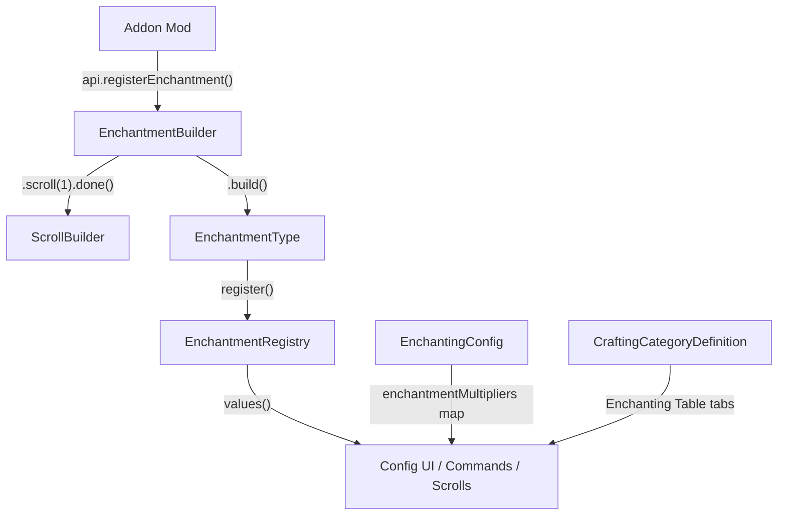

# Enchantment Registry API — System Report

## Overview

The enchantment system was redesigned from a hardcoded enum-based architecture to a dynamic registry that supports runtime registration of addon enchantments. The new system allows other mods to register enchantments with a fluent one-liner API, with Simple Enchantments handling scrolls, config, commands, and UI automatically.

---

## Architecture



---

## What Changed

### New Files

| File | Purpose |
|------|---------|
| [EnchantmentRegistry.java](file:///c:/Users/Elias/Documents/Simple-Enchantments/src/main/java/org/herolias/plugin/enchantment/EnchantmentRegistry.java) | Thread-safe singleton registry for all enchantments. Handles registration, conflict management, lookups by ID/display name. |
| [EnchantmentBuilder.java](file:///c:/Users/Elias/Documents/Simple-Enchantments/src/main/java/org/herolias/plugin/api/EnchantmentBuilder.java) | Fluent builder for registering addon enchantments. Supports scroll chaining, crafting category config, auto-derivation of defaults. |
| [ScrollDefinition.java](file:///c:/Users/Elias/Documents/Simple-Enchantments/src/main/java/org/herolias/plugin/api/ScrollDefinition.java) | Immutable data class for per-level scroll properties: recipe, quality/rarity, crafting tier, visual overrides (icon/model/texture). |
| [ScrollBuilder.java](file:///c:/Users/Elias/Documents/Simple-Enchantments/src/main/java/org/herolias/plugin/api/ScrollBuilder.java) | Fluent builder for configuring individual scroll levels. Chains back to [EnchantmentBuilder](file:///c:/Users/Elias/Documents/Simple-Enchantments/src/main/java/org/herolias/plugin/api/EnchantmentBuilder.java#32-250) via `.done()`. |
| [CraftingCategoryDefinition.java](file:///c:/Users/Elias/Documents/Simple-Enchantments/src/main/java/org/herolias/plugin/api/CraftingCategoryDefinition.java) | Registry for Enchanting Table tabs. Pre-registers 6 built-in categories, supports custom addon categories with name + icon. |

### Modified Files

| File | Changes |
|------|---------|
| [EnchantmentType.java](file:///c:/Users/Elias/Documents/Simple-Enchantments/src/main/java/org/herolias/plugin/enchantment/EnchantmentType.java) | Converted from `enum` → `final class`. 27 built-in enchantments as `public static final` constants. Added [name()](file:///c:/Users/Elias/Documents/Simple-Enchantments/src/main/java/org/herolias/plugin/enchantment/EnchantmentType.java#289-294) for backward compat, `scrollDefinitions` + [craftingCategory](file:///c:/Users/Elias/Documents/Simple-Enchantments/src/main/java/org/herolias/plugin/api/ScrollBuilder.java#92-105) fields, public constructor for addons. |
| [EnchantingConfig.java](file:///c:/Users/Elias/Documents/Simple-Enchantments/src/main/java/org/herolias/plugin/config/EnchantingConfig.java) | Unified `Map<String, Double> enchantmentMultipliers` replacing 25+ individual fields. Legacy fields kept as nullable `Double` for auto-migration. Config version bumped to 2.0. |
| [ConfigManager.java](file:///c:/Users/Elias/Documents/Simple-Enchantments/src/main/java/org/herolias/plugin/config/ConfigManager.java) | Calls `config.migrateFromLegacy()` after loading to handle old configs. |
| [EnchantConfigPage.java](file:///c:/Users/Elias/Documents/Simple-Enchantments/src/main/java/org/herolias/plugin/ui/EnchantConfigPage.java) | 7 methods refactored from per-field access to map-based: `ENCHANTMENT_MULTIPLIERS` static init, [cloneConfig()](file:///c:/Users/Elias/Documents/Simple-Enchantments/src/main/java/org/herolias/plugin/ui/EnchantConfigPage.java#144-212), [getMultiplierValue()](file:///c:/Users/Elias/Documents/Simple-Enchantments/src/main/java/org/herolias/plugin/ui/EnchantConfigPage.java#1157-1169), [updateSetting()](file:///c:/Users/Elias/Documents/Simple-Enchantments/src/main/java/org/herolias/plugin/ui/EnchantConfigPage.java#1228-1286), [getDefaultValue()](file:///c:/Users/Elias/Documents/Simple-Enchantments/src/main/java/org/herolias/plugin/ui/EnchantConfigPage.java#1267-1288), [saveConfig()](file:///c:/Users/Elias/Documents/Simple-Enchantments/src/main/java/org/herolias/plugin/config/SmartConfigManager.java#99-109), [resetAllToDefaults()](file:///c:/Users/Elias/Documents/Simple-Enchantments/src/main/java/org/herolias/plugin/ui/EnchantConfigPage.java#1364-1416). |
| [EnchantmentApi.java](file:///c:/Users/Elias/Documents/Simple-Enchantments/src/main/java/org/herolias/plugin/api/EnchantmentApi.java) | Added [registerEnchantment()](file:///c:/Users/Elias/Documents/Simple-Enchantments/src/main/java/org/herolias/plugin/api/EnchantmentApi.java#75-95), [getRegisteredEnchantment()](file:///c:/Users/Elias/Documents/Simple-Enchantments/src/main/java/org/herolias/plugin/api/EnchantmentApi.java#96-104), [isEnchantmentRegistered()](file:///c:/Users/Elias/Documents/Simple-Enchantments/src/main/java/org/herolias/plugin/api/EnchantmentApi.java#105-112), [addConflict()](file:///c:/Users/Elias/Documents/Simple-Enchantments/src/main/java/org/herolias/plugin/api/EnchantmentApi.java#113-120), [registerCraftingCategory()](file:///c:/Users/Elias/Documents/Simple-Enchantments/src/main/java/org/herolias/plugin/api/EnchantmentApi.java#121-137). |
| [EnchantmentApiImpl.java](file:///c:/Users/Elias/Documents/Simple-Enchantments/src/main/java/org/herolias/plugin/api/EnchantmentApiImpl.java) | Implemented all new API methods. |
| [ScrollDescriptionManager.java](file:///c:/Users/Elias/Documents/Simple-Enchantments/src/main/java/org/herolias/plugin/enchantment/ScrollDescriptionManager.java) | Switch statement → `type.getScrollBaseName()` delegation. |
| [ProjectileEnchantmentData.java](file:///c:/Users/Elias/Documents/Simple-Enchantments/src/main/java/org/herolias/plugin/enchantment/ProjectileEnchantmentData.java) | Enum switch → if-else chain. |
| [EnchantmentRecipeManager.java](file:///c:/Users/Elias/Documents/Simple-Enchantments/src/main/java/org/herolias/plugin/enchantment/EnchantmentRecipeManager.java) | Local [getScrollBaseName()](file:///c:/Users/Elias/Documents/Simple-Enchantments/src/main/java/org/herolias/plugin/enchantment/EnchantmentType.java#482-503) → delegates to `type.getScrollBaseName()`. |

---

## How the New System Works

### 1. Enchantment Registration

All enchantments (built-in and addon) are stored in [EnchantmentRegistry](file:///c:/Users/Elias/Documents/Simple-Enchantments/src/main/java/org/herolias/plugin/enchantment/EnchantmentRegistry.java#16-169), a thread-safe singleton. Built-in enchantments auto-register via static initializers on [EnchantmentType](file:///c:/Users/Elias/Documents/Simple-Enchantments/src/main/java/org/herolias/plugin/enchantment/EnchantmentType.java#17-521). Addon enchantments register via the API.

**Static methods for backward compatibility:**
- `EnchantmentType.values()` → all registered enchantments (was enum method)
- `EnchantmentType.fromId(String)` → lookup by ID
- `EnchantmentType.findByDisplayName(String)` → lookup by display name
- `EnchantmentType.name()` → returns `id.toUpperCase()` (was enum method)

### 2. Configuration

All enchantment multipliers are stored in a unified `Map<String, Double> enchantmentMultipliers` on [EnchantingConfig](file:///c:/Users/Elias/Documents/Simple-Enchantments/src/main/java/org/herolias/plugin/config/EnchantingConfig.java#11-262), keyed by enchantment ID. When a new enchantment registers, it auto-populates its default multiplier via `putIfAbsent`.

**Migration:** On server startup, [migrateFromLegacy()](file:///c:/Users/Elias/Documents/Simple-Enchantments/src/main/java/org/herolias/plugin/config/EnchantingConfig.java#97-155) reads old per-field values (e.g., `sharpnessDamageMultiplierPerLevel`) and copies them into the map. Old config files (v1.x) are automatically upgraded to v2.0.

**Config UI:** The in-game config page dynamically iterates `EnchantmentType.values()`, showing:
- Enable/disable toggle for every enchantment
- Multiplier slider only for enchantments with `defaultMultiplierPerLevel > 0`

### 3. Scroll System

Each [EnchantmentType](file:///c:/Users/Elias/Documents/Simple-Enchantments/src/main/java/org/herolias/plugin/enchantment/EnchantmentType.java#17-521) can have [ScrollDefinition](file:///c:/Users/Elias/Documents/Simple-Enchantments/src/main/java/org/herolias/plugin/api/ScrollDefinition.java#17-68) objects attached (one per level). These define:

| Property | Description | Default |
|----------|-------------|---------|
| [quality](file:///c:/Users/Elias/Documents/Simple-Enchantments/src/main/java/org/herolias/plugin/api/ScrollBuilder.java#70-81) | Item rarity ("Common"→"Legendary") | "Uncommon" |
| [craftingTier](file:///c:/Users/Elias/Documents/Simple-Enchantments/src/main/java/org/herolias/plugin/api/ScrollBuilder.java#82-91) | Enchanting Table tier required (1-4) | 1 |
| [craftingCategory](file:///c:/Users/Elias/Documents/Simple-Enchantments/src/main/java/org/herolias/plugin/api/ScrollBuilder.java#92-105) | Tab in the Enchanting Table | Auto-derived from item category |
| `recipe` | List of [Ingredient(itemId, quantity)](file:///c:/Users/Elias/Documents/Simple-Enchantments/src/main/java/org/herolias/plugin/api/ScrollDefinition.java#54-67) | Empty (uses SE defaults) |
| `icon/model/texture` | Visual overrides | SE's default scroll assets |
| `iconProperties` | Scroll icon [scale, translation, rotation](file:///c:/Users/Elias/Documents/Simple-Enchantments/src/main/java/org/herolias/plugin/api/ScrollDefinition.java#69-97) properties | Scale: 0.84, Translation: [5, 15], Rotation: [90, 45, 0] |

### 4. Crafting Categories

The Enchanting Table uses category tabs. 6 built-in categories are pre-registered:

| Category ID | Display Name |
|------------|-------------|
| `Enchanting_Melee` | Melee |
| `Enchanting_Ranged` | Ranged |
| `Enchanting_Armor` | Armor |
| `Enchanting_Shield` | Shield |
| `Enchanting_Staff` | Staff |
| `Enchanting_Tools` | Tools |

Addon mods can register custom categories with `api.registerCraftingCategory(id, name, iconPath)`.

---

## Addon Mod Usage Example

```java
// In your mod's setup method:
EnchantmentApi api = EnchantmentApiProvider.get();

// Register a custom crafting category (optional)
api.registerCraftingCategory("Enchanting_Magic", "Magic", "Icons/MagicTab.png");

// Register the enchantment with custom scrolls
EnchantmentType lightning = api.registerEnchantment("my_mod:lightning", "Lightning Strike")
    .description("Chance to strike enemies with lightning")
    .maxLevel(3)
    .multiplierPerLevel(0.15)
    .bonusDescription("Lightning strike chance: {amount}%")
    .appliesTo(ItemCategory.MELEE_WEAPON, ItemCategory.RANGED_WEAPON)
    .craftingCategory("Enchanting_Magic")
    .scroll(1)
        .quality("Uncommon")
        .craftingTier(1)
        .ingredient("Ingredient_Crystal_Blue", 5)
        .ingredient("My_Mod_Lightning_Shard", 3)
        .done()
    .scroll(2)
        .quality("Rare")
        .craftingTier(2)
        .ingredient("Ingredient_Crystal_Blue", 10)
        .ingredient("My_Mod_Lightning_Shard", 8)
        .texture("Items/Scrolls/LightningScroll.png")
        .done()
    .scroll(3)
        .quality("Epic")
        .craftingTier(3)
        .ingredient("Ingredient_Crystal_Blue", 20)
        .ingredient("My_Mod_Lightning_Shard", 15)
        .texture("Items/Scrolls/LightningScroll.png")
        .icon("Icons/LightningScroll.png")
        .iconProperties(0.9f, 6f, 16f, 90f, 45f, 0f)
        .done()
    .build();

// Declare conflicts (optional)
api.addConflict("my_mod:lightning", "burn");
api.addConflict("my_mod:lightning", "freeze");

// Register custom items as enchantable (optional)
api.registerItemToCategory("My_Magic_Sword", "MELEE_WEAPON");
```

After calling `.build()`, the enchantment is automatically:
- Available via `/enchant my_mod:lightning 2`
- Visible in the config UI with enable/disable toggle + multiplier slider
- Configurable by server admins (multiplier, enable/disable)
- Scroll items auto-generated with custom recipes and visuals
- Tooltips display the bonus description with calculated values

---

## Backward Compatibility

| Concern | Solution |
|---------|----------|
| Old config files (v1.x) | Auto-migrated via [migrateFromLegacy()](file:///c:/Users/Elias/Documents/Simple-Enchantments/src/main/java/org/herolias/plugin/config/EnchantingConfig.java#97-155), version bumped to 2.0 |
| `EnchantmentType.name()` | Added as instance method returning `id.toUpperCase()` |
| `EnchantmentType.values()` | Delegates to registry, returns all enchantments |
| `EnchantmentType.SHARPNESS` etc. | Preserved as `public static final` constants |
| Existing API ([addEnchantment](file:///c:/Users/Elias/Documents/Simple-Enchantments/src/main/java/org/herolias/plugin/api/EnchantmentApiImpl.java#26-50), [hasEnchantment](file:///c:/Users/Elias/Documents/Simple-Enchantments/src/main/java/org/herolias/plugin/enchantment/EnchantmentData.java#90-96), etc.) | Unchanged, works identically |
| Per-field config access in internal code | Fully replaced with map lookups |

---

## Configuration Directory Migration

To address user feedback regarding configuration files cluttering the base `config/` directory, the system now stores all configuration files inside `mods/Simple_Enchantments_Config/`. 

### Migrated Files
The following files are now located in `mods/Simple_Enchantments_Config/`:
1. `simple_enchanting_config.json`
2. `.simple_enchanting_config.json.snapshot`
3. `simple_enchantments_user_config.json`
4. `simple_enchanting_custom_items.json`
5. `.simple_enchanting_custom_items.json.snapshot`

### Automatic Migration
The system automatically handles the transition for existing users:
- During server startup, if the old `config/` directory contains any of the above files, they are automatically moved to the new `mods/Simple_Enchantments_Config/` directory.
- The old `config/` folder is safely deleted if it becomes empty after the migration.
- For new users, the old `config/` folder is never created, ensuring a clean installation.
